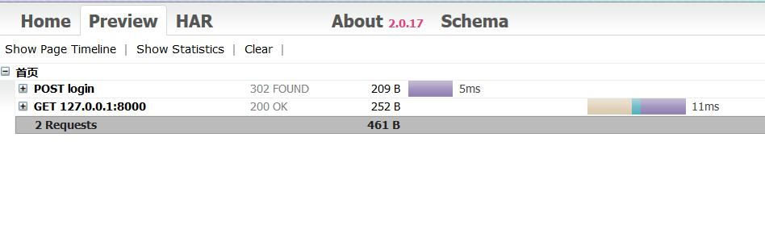
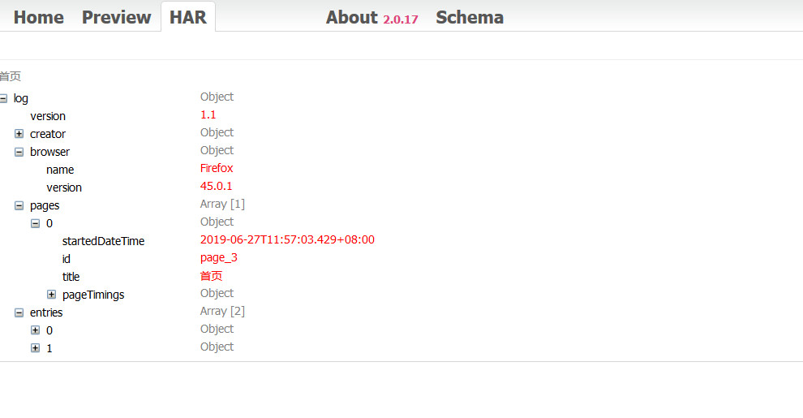

# harparser
HTTP Archive Parser
-----------------------------------
使用方法如下:  

```
from harparser import harparser

har_file = 'xxx.har'
request,response = harparser(har_file)
```

使用要进行调试可以在harparser中传入参数`debug=True`。  
对应的har效果如下:  



切换到HAR选项时的效果:  



对应的地址为`http://www.softwareishard.com/har/viewer/`。